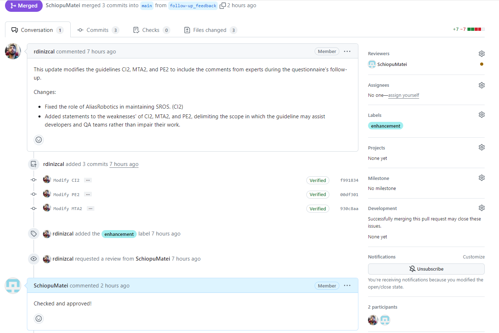

# ROS-RVFT

This repository complements the paper *"Runtime Verification and Field-based Testing for ROS-Based Robotic Systems"* and is an online repository of the guideline catalog for ROS-based Robotics projects.

Contribute to our Guidelines by following the instructions:

### Step 1: Fork

Fork the [project](https://github.com/ros-rvft/ros-rvft.github.io) on GitHub and clone your fork locally. Make sure you do so from the 'main' branch.

`git clone https://github.com/ros-rvft/ros-rvft.github.io`

### Step 2: Branch

Create a branch and start writing! You can modify existing guidelines, or propose a new one starting from our [guideline template](https://github.com/ros-rvft/ros-rvft.github.io/guideline_template).

`git checkout -b my-branch -t origin/main`  

### Step 3: Commit

Submit all of your changed files and commit!

`git add my/changed/files`  
`git commit`

### Step 4: Push

Push your commits to the repository, creating a pull request to the main branch.

`git push origin my-branch`

### Step 5: Discuss

After the pull request was created, keep track of it on github where you can discuss your contributions with the team!

### Step 6: Merge

The pull request review is finished and the final version of your contribution is added to the guidelines!

Here's an example of a contribution: [Feedback Pull Request](https://github.com/ros-rvft/ros-rvft.github.io/pull/1)

Fork and make additions directly to the source files. Create a pull request and we'll begin discourse in the reviewing process!

You can also forward suggestions directly to [ricardo.caldas@chalmers.se](mailto:"ricardo.caldas@chalmers.se")!
